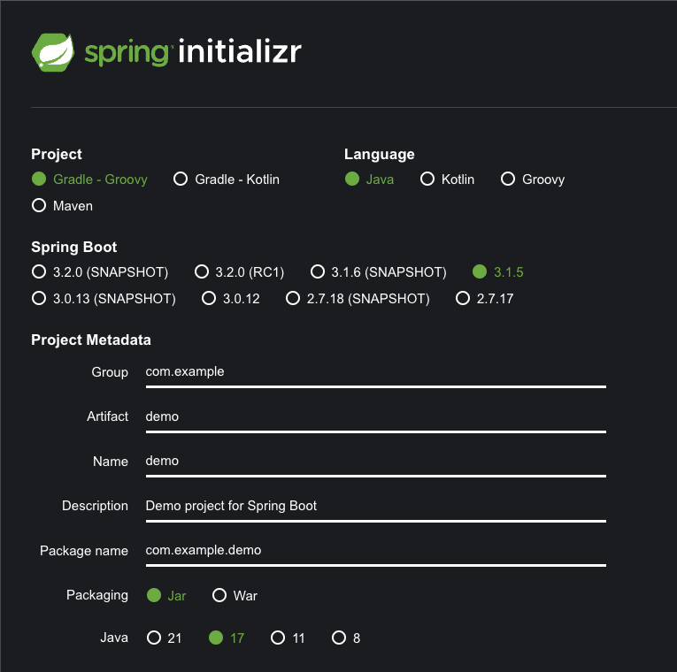
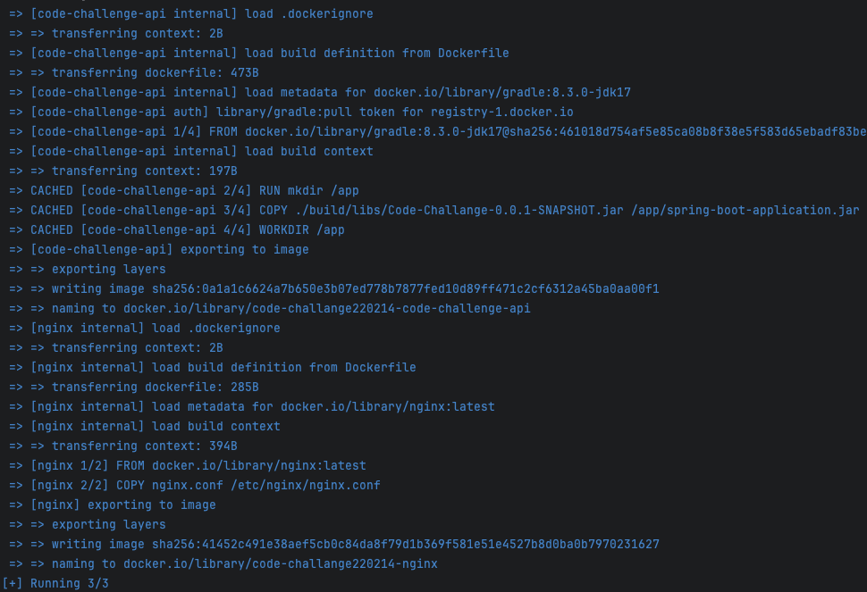
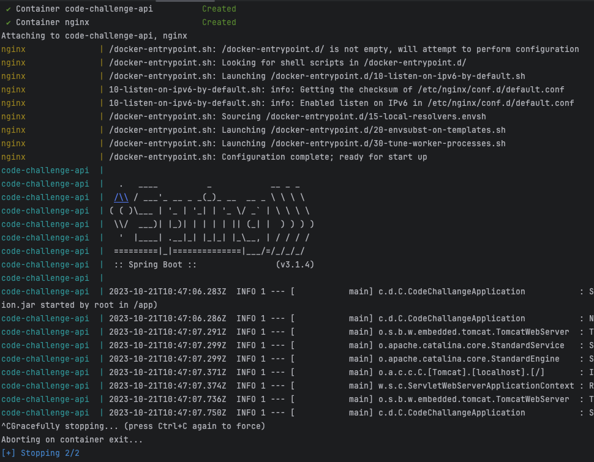
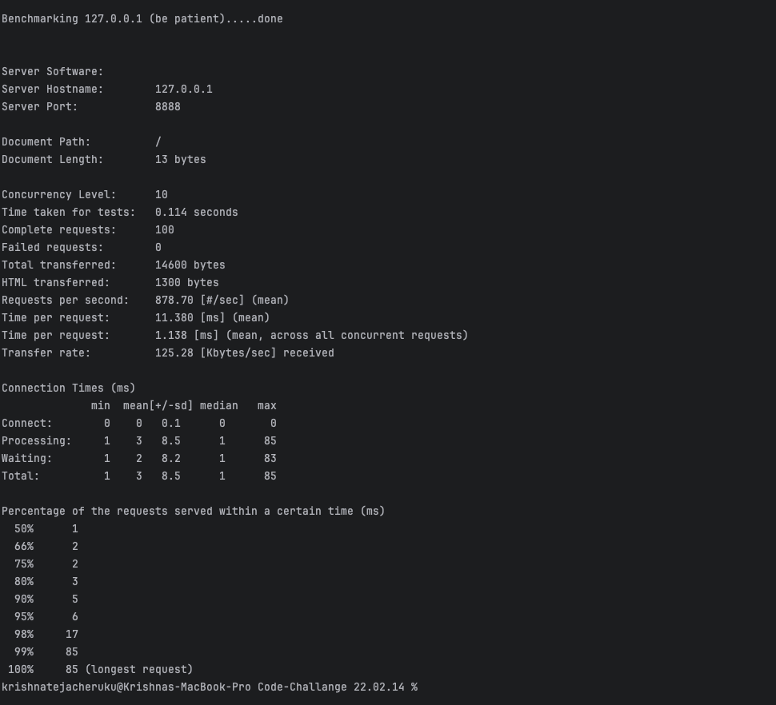

#  Project Documentation

This is a Markdown document for project documentation. 

## Table of Contents

1. [Introduction](#introduction)
2. [Installation](#installation)
3. [Usage](#usage)


## Introduction

A simple web service with a RESTful API was built using java17 and Apache Groovy, the service will allow you to upload terraform_statefile file using curl & respond with all security groups in this file.
Also, a Dockerfile which will have service from api was built. It will run without ports exposing, so it’s not available from other hosts.
A second docker was built & linked to the first container, proxying requests to it, and does flood prevention/rate-limiting by source IP address.
A script for stress testing was included in repository to check if rate limiting is working.

## Installation

1). package com.digitalturbine.CodeChallange; was built using [start.spring.io]()  

  

2). Import the additional dependencies   
3). Docker for running containers  
4). Apache Benchmark for stress testing , In Mac M1, M2 they are in-built so there is no necessary to install it separately.

## Usage

###  Code

```java
import org.json.JSONArray;
import org.json.JSONObject;
import org.springframework.web.bind.annotation.RestController;
import org.springframework.web.multipart.MultipartFile;
import org.springframework.http.ResponseEntity;  
```
Please include the above dependencies in your project for the code to run successfully.  


``` shell
jar [OPTION ...] [ [--release VERSION] [-C dir] files] ..

```
A jar file has to be created to copy the JAR file from your local machine to the Docker image.

```shell

 ./gradlew bootRun --args='--server.port=8888' 

```
To test the Java app on your local machine run the above command, Since our Nginx service uses port 8080:8081 for communication, the application has to boot run from port 8888.  

````shell
docker compose up

````
Two separate Docker files exist in our project , one for the api and the other for Nginx acting as proxy. A configuration file exists in the folder nginx which acts as a Rate-limiting by source IP address. 
This command will allow you to run the container and thus running application as well.  

```shell
- curl -v -H "content-type: multipart/form-data" http://127.0.0.1:8080/process -F file=@<path to a file> 
```
Processes the given file and produces aws_security_group primary id's as a response.  

```shell
- curl -v -H "content-type: multipart/form-data" http://127.0.0.1:8080/process -F file=@devops_interview_terraform_state.json -F attribute_key=source_security_group_id -F attribute_value=sg-21fc3144
```
Processes the given file based on attribute_key & attribute_value and produce primary id's as a response.  

```shell
sh stress_test.sh 
```
This command  runs a script for stress testing to check if rate limiting is working.  


  


  


